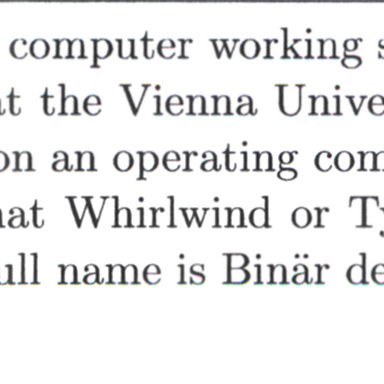
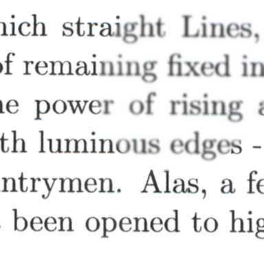
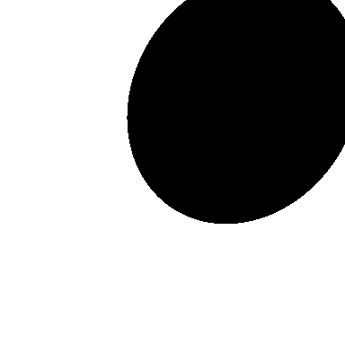
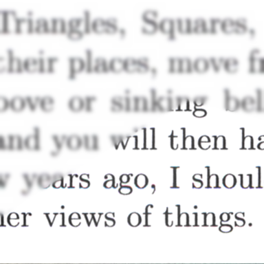

# Generate a synthetically blurred version of the CVL-DataBase [^1]

Tool to create a blurred version and corresponding ground truths of the dataset.

## Preparation
Extract the trainset and testset folders into `data/in`. Both folders should contain the `xml` directory and the extracted images from `pages` subfolder. E.g. `data/in/testset/xml/xxxx_attributes.xml` and `data/in/testset/xxxx.tif`

## Usage
Create trainset:
```sh
generate.py -s 0 -r --input-path data/in/trainset --output-path data/out/trainset
```

Create testset:
```sh
generate.py -s 0 -r --input-path data/in/testset --output-path data/out/testset --separate-by-blur --size 320
```

The generator automatically discards crops which would be mostly white with no text on it. You should still manually clean up the computer and handwritten subfolder, as some of the regions in the XML are wrong and there might be a few handwritten crops in the computer directory. You can run `diff.py` to show the differences between the source and gt directories.

## Examples

sigma 0.5:



sigma 1.5:



sigma 3:



[^1]: [10.5281/zenodo.1492267](https://doi.org/10.5281/zenodo.1492267)
